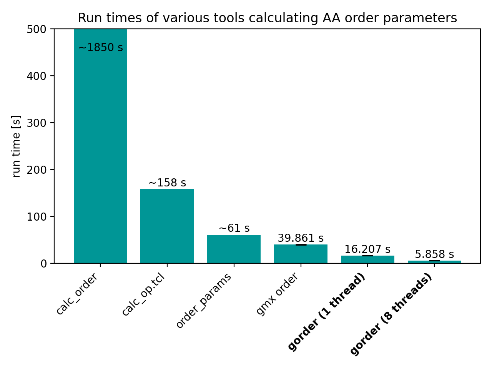
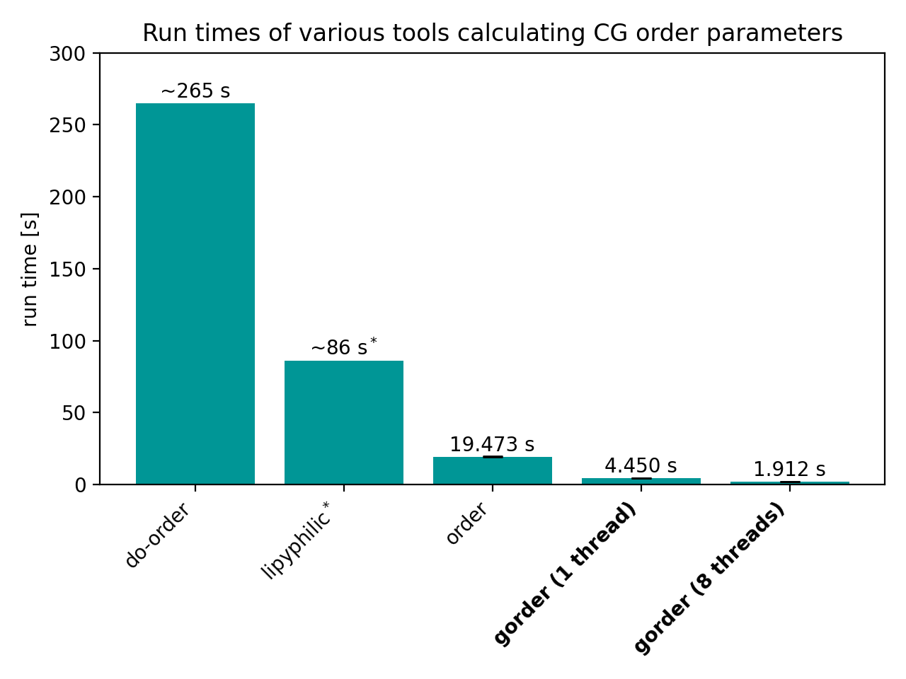
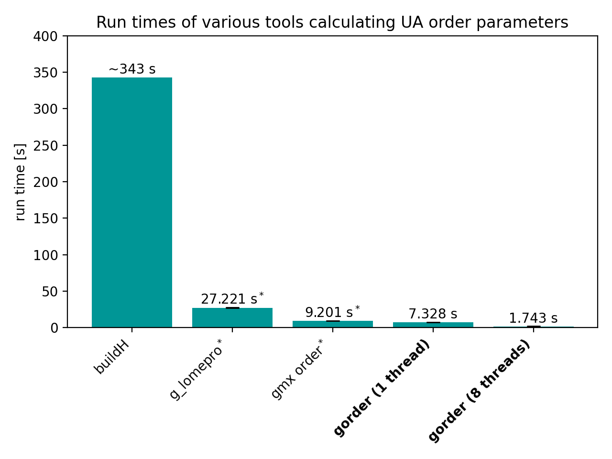

# gorder: Everything you will ever need for lipid order calculations
[](https://doi.org/10.5281/zenodo.14391305) 

Command line tool for calculating lipid order parameters from Gromacs simulations. 

See also the [GUI version](https://github.com/VachaLab/guiorder) of `gorder`.

## Quick links
- [The manual](https://vachalab.github.io/gorder-manual/) describing how to use `gorder`.

- [The article](https://doi.org/10.1016/j.softx.2025.102254) describing how `gorder` works.

## Installation

1. [Install Rust](https://www.rust-lang.org/tools/install)

2. Install gorder:
```bash
$ cargo install gorder
```

## Usage

1) Prepare a yaml file describing the parameters of your analysis. It's as simple as:

```yaml
structure: system.tpr
trajectory: md.xtc     # use your MD trajectory directly - no PBC handling or molecule fixing needed
analysis_type: !AAOrder
    heavy_atoms: "element name carbon"
    hydrogens: "element name hydrogen"
output: order.yaml
```

> *You can also specify the analysis parameters via a graphical user interface provided by [GUIorder](https://github.com/VachaLab/guiorder)!*

2) Run the `gorder` tool. The program will automatically find bonds between the selected atoms, classify lipid molecules, and calculate order parameters for them.

```
$ gorder YOUR_INPUT_YAML_FILE
```

3) See the results of the analysis in `order.yaml`.

**See the [gorder manual](https://vachalab.github.io/gorder-manual/) for more information about using this program.**

## Features
- ⚛️ **[Atomistic](https://vachalab.github.io/gorder-manual/aaorder_basics.html), [coarse-grained](https://vachalab.github.io/gorder-manual/cgorder_basics.html), and [united-atom](https://vachalab.github.io/gorder-manual/uaorder_basics.html) systems**   
Calculates order parameters for individual bonds of individual lipid types in atomistic, coarse-grained, and united-atom systems.

- 🔠 [**Powerful selection language**](https://vachalab.github.io/gsl-guide/)  
Allows for simple yet powerful atom selection using a VMD-like selection language, supporting regular expressions and groups from NDX files.

- 🔍 **Automatic identification of molecule types**  
Automatically recognizes bonds and classifies molecule types based on their topology. Order parameters are calculated and reported separately for each molecule type.

- 📋 [**Various output formats**](https://vachalab.github.io/gorder-manual/output.html)  
Outputs results in YAML, XVG, CSV, and custom "table" format.

- 🏗️ **Any model and force-field**  
Is completely force-field agnostic. Martini? CHARMM? Slipids? Berger lipids? Your own toy force-field? As long as your lipids have bonds, it will work.

- 🍃 [**Leaflet-wise analysis**](https://vachalab.github.io/gorder-manual/leaflets.html)  
Performs scrambling-safe assignment of lipids to membrane leaflets using one of five different methods, and then calculates lipid order parameters for individual leaflets.

- 🟠 [**Order parameters for vesicles**](https://vachalab.github.io/gorder-manual/membrane_normal.html)  
Dynamically calculates membrane normals based on the membrane's shape, enabling the calculation of order parameters for highly curved systems such as micelles, tubes, and vesicles.

- 🗺️ [**Order parameter maps**](https://vachalab.github.io/gorder-manual/ordermaps.html)  
Constructs 2D projections of order parameters, so you know what parts of the membrane are ordered and disordered.

- 📉 [**Error estimation**](https://vachalab.github.io/gorder-manual/errors.html)  
Automatically estimates the error of the analysis and indicates how well your analysis has converged.

- 🌍 [**Analysis of specific membrane regions**](https://vachalab.github.io/gorder-manual/geometry.html)  
Dynamically selects lipids in a specified part of the membrane and calculates order parameters only for them.

- 🔗 [**Trajectory concatenation**](https://vachalab.github.io/gorder-manual/multiple_trajectories.html)  
Seamlessly concatenates multiple XTC trajectories during the analysis, in most cases eliminating the need for data preprocessing.

- ⚡ [**Extremely fast**](#benchmarking)  
Is extremely fast due to its ability to read only the necessary atoms from XTC files and its support for multithreading.

- 🎨 [**Graphical user interface**](https://vachalab.github.io/gorder-manual/guiorder.html)   
Has a companion tool [GUIorder](https://github.com/VachaLab/guiorder) that simplifies specifying analysis parameters via a graphical user interface.

- 👨‍💻 **[Python](https://vachalab.github.io/gorder-manual/python_api.html) and [Rust](https://vachalab.github.io/gorder-manual/rust_api.html) API**  
Is also available as a Python package and a Rust crate, allowing seamless integration with Python and/or Rust code.

- 📖 [**Extensive manual**](https://vachalab.github.io/gorder-manual/introduction.html)  
Includes a comprehensive manual detailing how to use the program, along with its strengths and limitations.

## Validation

### Atomistic order parameters
A CHARMM36m simulation of a membrane consisting of 256 lipids was used to validate the calculation of atomistic order parameters. In total, the system contained ~64,500 atoms. The trajectory was 200 ns long and consisted of 10,000 frames. The following tools were used for validation:
- [`OrderParameter.py` by NMR Lipids](https://github.com/NMRLipids/Databank/blob/6a91be2270e89ec7bb9c75006c2f2a2507c24a01/Scripts/BuildDatabank/OrderParameter.py)
- [VMD's `calc_op.tcl` script](https://www.ks.uiuc.edu/Research/vmd/mailing_list/vmd-l/att-14731/calc_op.tcl)
- [`order_params` tool provided as a part of `LOOS`](https://github.com/GrossfieldLab/loos)


*Left chart shows the results for the palmitoyl tail of POPC, the right chart for the oleoyl tail. All tools return the same results.*

### Coarse-grained order parameters
A Martini 3 simulation of a membrane consisting of 512 POPC lipids was used to validate the calculation of CG order parameters. In total, the system contained ~16,800 beads. The trajectory had a length of 1 μs and consisted of 10,000 frames. The following tools were used for validation:
- [Martini's `do-order` script](https://cgmartini.nl/docs/downloads/tools/other-tools.html#do-order)
- [`lipyphilic` library](https://lipyphilic.readthedocs.io/en/stable/index.html)
- [Ladme's `order` program](https://doi.org/10.5281/zenodo.8369479)


*All programs produce the same results. Minor variations due to the employed calculation approaches are too small to be visible in the chart.*

### United-atom order parameters
A Berger lipids simulation of a membrane obtained from the NMR Lipids DataBank [[link to archive](https://zenodo.org/records/1402417)] consisting of 256 POPC lipids was used to validate the calculation of UA order parameters. In total, the system contained ~44,300 atoms. The trajectory had a length of 300 ns and consisted of 3,000 frames. The following tools were used for validation:
- [`buildH` tool](https://github.com/patrickfuchs/buildH)
- [`g_lomepro` program](https://github.com/vgapsys/g_lomepro/)
- [`gmx order`](https://manual.gromacs.org/2024.4/onlinehelp/gmx-order.html) (saturated carbons only)


*Left chart shows the results for the palmitoyl tail of POPC, the right chart for the oleoyl tail. `buildH` and `gorder` generate identical output. `g_lomepro` also produces the same output, except for the methyl carbon, for which no order parameter is reported. `gmx order` behaves the same as `g_lomepro` for the palmitoyl tail, but, as reported previously [[link to article](https://doi.org/10.1021/acs.jctc.7b00643)], returns incorrect order parameters for unsaturated carbons of the oleoyl tail.*

## Benchmarking
### Atomistic order parameters
Run times of the analyses performed in the Validation section by various tools. We also show the performance of `gmx order`, even though it actually calculates united-atom order parameters, because it is (unfortunately) commonly used for analyses of all-atom systems as well:


*Benchmarks were conducted using `gorder` version 1.3 on GNU/Linux Mint 20.2 with an 8-core Intel Core i7-11700 CPU and Samsung 870 EVO SSD. The benchmarks were run with a cold cache using [`hyperfine`](https://github.com/sharkdp/hyperfine). Both `gorder` and `gmx order` were run 5 times each, while `calc_order`, `calc_op.tcl`, and `order_params` were slower so only 1 run for each was performed.*

<sup>*</sup> Note that `order_params` requires the analysis to be run twice to obtain full order parameters for both chains. The reported time is for both runs.

<sup>#</sup> Note that `gmx order` requires the analysis to be run twice to obtain full order parameters for both chains. More importantly, note that `gmx order` does not calculate the order parameters correctly. **You should not use it for an atomistic system!** Even if you only want to calculate lipid order parameters for a single (saturated) chain, `gmx order` is still much slower than `gorder` run using a single thread (20.7 seconds vs 10.7 seconds).

### Coarse-grained order parameters
Run times of the analyses performed in the Validation section by various tools:


*Benchmarks were conducted using `gorder` version 1.3 on GNU/Linux Mint 20.2 with an 8-core Intel Core i7-11700 CPU and Samsung 870 EVO SSD. The benchmarks were run with a cold cache using [`hyperfine`](https://github.com/sharkdp/hyperfine). Both `gorder` and `order` were run 5 times each, while `do-order` and `lipyphilic` were dramatically slower so only 1 run for each was performed.*

<sup>*</sup> Note that the `lipyphilic` library is not able to calculate order parameters for the individual bonds simultaneously, requiring the analysis to be run multiple times. The reported time is the sum of all runs. If you are only interested in average order parameters for one entire lipid tail, `lipyphilic` is quite fast (though still slower than `gorder`).

### United-atom order parameters
Run times of the analyses performed in the Validation section by various tools:


*Benchmarks were conducted using `gorder` version 1.3 on GNU/Linux Mint 20.2 with an 8-core Intel Core i7-11700 CPU and Samsung 870 EVO SSD. The benchmarks were run with a cold cache using [`hyperfine`](https://github.com/sharkdp/hyperfine). `gorder`, `g_lomepro`, and `gmx order` were run 5 times each, while `buildH` was dramatically slower so only 1 run was performed for it. `g_lomepro` was run using 8 threads.*

<sup>*</sup> Note that `g_lomepro` and `gmx order` require the analysis to be run twice to obtain full order parameters for both chains. The reported times are for both runs. Even if you only want to calculate lipid order parameters for a single (saturated) chain, `gmx order` is still slightly slower than `gorder` run using a single thread (4.75 seconds vs 4.09 seconds).

## Python and Rust API
`gorder` is also available as a Python package and a Rust crate. For more information, see the [gorder manual](https://vachalab.github.io/gorder-manual/), the [Python API documentation](https://vachalab.github.io/pygorder-docs), or the [Rust API documentation](https://docs.rs/gorder/latest/gorder).

## License
The command line tool, the Python package, and the Rust crate are all released under the MIT License.

## Limitations
- `gorder` does not fully support simulation boxes that are **not** orthogonal. [You can still use them but it requires some additional effort.](https://vachalab.github.io/gorder-manual/no_pbc.html)
- `gorder` does not support TPR files generated with Gromacs older than version 5.1. [But you can use PDB, GRO, or PQR file instead.](https://vachalab.github.io/gorder-manual/other_structure.html)
- `gorder` reports order parameters for atoms (bonds) in the order in which they appear in the provided structure file. This is not necessarily the same order as in the acyl chains.